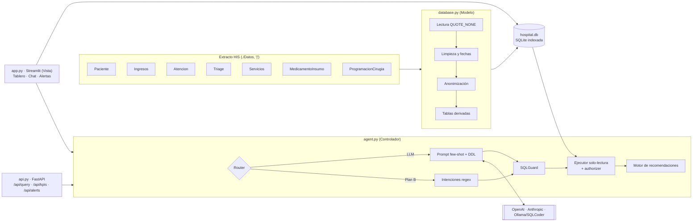
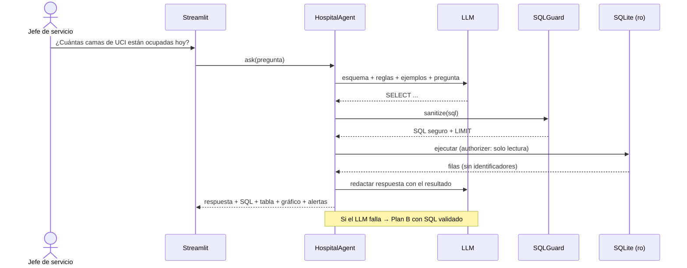

# HSLV · Centro de mando operativo con Agente IA

**Hackatón de Ingeniería de Sistemas · Campus Party FUP 2026**
Reto: Hospital Susana López de Valencia (Popayán, mediana complejidad, ~500 pacientes/día).

## El problema

La información de ocupación de camas, tiempos de espera, quirófanos y farmacia vive en sistemas separados.
Directivos y jefes de servicio dependen de reportes manuales de TI, y las decisiones críticas llegan tarde.

## La solución

Un MVP que unifica el extracto del HIS en una base SQLite y ofrece tres herramientas:

1. **Asistente IA (NL2SQL):** preguntas en español → SQL de solo lectura → respuesta, tabla, gráfico y SQL visible.
   Si el LLM falla o no hay API key, un **Plan B** con SQL validado responde las preguntas clave.
2. **Tablero de KPIs:** ocupación por unidad, espera por triage, causa raíz por turno, diagnósticos,
   rotación de medicamentos, cumplimiento quirúrgico, especialidades y perfil de pacientes.
3. **Alertas y acciones:** sobreocupación con camas a habilitar y personal a reasignar, stock crítico con
   orden de compra, picos de demanda por patología, metas de triage y balance de quirófanos.

---

## Ejecución en 2 pasos

```bash
# 0. (una vez) copia los 7 archivos .txt del reto en ./Datos/
# 1. Instalar dependencias (Python 3.10+)
pip install -r requirements.txt

# 2. Ejecutar (la base hospital.db se construye sola en el primer arranque, ~20 s)
streamlit run app.py
```

Opcional:

```bash
cp .env.example .env              # y configura LLM_PROVIDER + API key para activar el LLM
python database.py --rebuild      # reconstruir la base manualmente
uvicorn api:app --port 8000       # API REST -> http://localhost:8000/docs
python agent.py                   # demo por consola de las 4 preguntas
python -m pytest -q               # 65 pruebas (seguridad, intenciones, LLM simulado, ciclo clínico, RBAC)
```

Sin `.env` todo funciona en modo **Plan B** (sin red y sin costo).

---

## Versión 2: módulo clínico con roles (RBAC)

La v2 agrega una base transaccional separada (`clinico.db`, esquema en `sql/schema_clinico.sql`) con usuarios,
roles, turnos, historias clínicas, prescripciones, dispensación, citas y un libro mayor de inventario. La interfaz
muestra a cada rol solo sus secciones:

| Sección | Admin | Doctor | Enfermería | Paciente |
|---|:-:|:-:|:-:|:-:|
| Tablero (KPIs directivos, camas, urgencias, epidemiología) | ✓ completo | camas y urgencias | camas y urgencias | |
| Asistente IA (NL2SQL) | ✓ | ✓ | | |
| Alertas y acciones (semáforo, orden de compra, acciones) | ✓ + CSV | ✓ | ✓ | |
| Clínico y farmacia (historias, prescripción, dispensación) | | ✓ | ✓ (sin prescribir) | |
| Mi portal (fórmulas y citas propias) | | | | ✓ |
| Datos y auditoría (extractos, bitácora) | ✓ | | | |

`clinico.db` se crea y se siembra sola en el primer arranque: 4 usuarios de demostración, turnos diurnos y
6 historias clínicas sobre pacientes e ingresos **reales** del extracto. Las fórmulas y las citas son **sintéticas**.
El menú "🕒 Reloj de demo" cambia a turno nocturno o reinicia el escenario sin tocar la base analítica.

### Guion de demostración (≈4 minutos)

1. **Admin** → Tablero: 5 KPIs y 3 alertas críticas. En Alertas, el semáforo y la orden de compra en CSV.
2. **Dra. Ruiz** → Clínico y farmacia: la historia del paciente 110 con su línea de tiempo inmutable.
3. **Enf. Gómez** → Dispensación → **"Simular avance de 72 horas"**: 15 dosis de acetaminofén y 10 de enoxaparina
   vuelven a stock. La enoxaparina, de continuidad crítica, genera una alerta en lugar de un bloqueo.
4. **Paciente 110** → Mi portal: la fórmula aparece caducada → "Solicitar cita".
5. **Dra. Ruiz** → Prescripción: "Atender cita" levanta el bloqueo.
6. Reloj → **Turno de noche** → Historias: el acceso queda bloqueado → "Romper el vidrio" con justificación.
7. **Admin** → Datos y auditoría → Bitácora: el acceso de emergencia aparece registrado.

Antes de cada ensayo usa "↺ Reiniciar escenario clínico".

## Arquitectura



**Secuencia de una pregunta**



| Módulo | Rol MVC | Qué hace |
|---|---|---|
| `config.py` | — | Variables de `.env`, rutas y umbrales de negocio |
| `database.py` | Modelo | ETL, 12 tablas indexadas, funciones de KPI reutilizables |
| `agent.py` | Controlador | NL2SQL, `SQLGuard`, ejecutor seguro, Plan B, `RecommendationEngine`, Factory de LLM |
| `app.py` + `ui/` | Vista | Cabecera contextual, navegación por rol y páginas (analíticas y clínicas) |
| `pharmacy_service.py` | Servicio | Ciclo de prescripción, caducidad con retorno a stock y autorización RBAC |
| `demo_seed.py` | — | Escenario de demostración y reloj clínico |
| `api.py` | Servicio | Endpoints REST del reto |
| `tests/` | — | Pruebas de seguridad, intenciones y flujo LLM |

## Modelo de datos (`hospital.db`)

| Tabla | Filas | Contenido |
|---|---:|---|
| `pacientes` | 14.502 | Anonimizada: sexo, edad, grupo etario, régimen, asegurador, municipio, zona |
| `ingresos` | 17.781 | Episodio + servicio normalizado, capítulo CIE-10, espera, triage, turno, estancia estimada |
| `atenciones` | 17.375 | Primera atención médica |
| `triage` | 16.106 | Clasificación y signos vitales (sin motivo de consulta) |
| `servicios` | 582.357 | Procedimientos CUPS, área y especialidad |
| `medicamentos_insumos` | 579.465 | Dispensación + tipo de ítem |
| `inventario_farmacia` | 1.327 | Consumo 30 días, rotación, stock, días de inventario |
| `ocupacion_diaria` | 2.736 | Censo diario por unidad: capacidad, ocupadas, % |
| `camas` | 712 | Catálogo de camas observadas (capacidad) |
| `cirugias` | 6.156 | Programación consolidada y estado (realizada / sin evidencia) |

## Decisiones tomadas a partir de los datos

Estas decisiones salieron de perfilar el extracto antes de programar; conviene mencionarlas ante el jurado.

- **"Hoy" = 21/09/2026**, la última fecha de ingreso del extracto (configurable con `REFERENCE_DATE`).
  Usar la fecha del sistema devolvería cero en todas las preguntas "de hoy".
- **Triage.txt trae comillas sin cerrar** en `MotivoConsulta`: el lector estándar de pandas descarta cientos de
  filas en silencio. Se lee con `quoting=QUOTE_NONE` y no se pierde ninguna.
- **No hay fecha de egreso.** La estancia se estima desde la hospitalización hasta la última prestación
  (servicio o medicamento) registrada.
- **`CodigoCama` es la última cama del episodio.** Un paciente que pasó por UCI y terminó en hospitalización no
  figura como UCI. Consecuencias: la foto del día es confiable (los pacientes que hoy están en UCI sí aparecen),
  pero la serie histórica subestima UCI e intermedios. Por eso el tablero añade los **días-cama facturados**
  (CUPS de internación) y los picos de demanda se calculan por **capítulo CIE-10**, no por servicio: por servicio,
  UCI aparentaba un falso +187 %.
- **No hay existencias de farmacia.** El consumo diario es real; el stock se simula de forma determinística y
  queda marcado (`stock_simulado = 1`). Si farmacia entrega `Datos/Inventario.txt` (`CodigoServicio|Stock`),
  el cálculo pasa a ser real sin tocar código.
- **Cirugías:** solo 1.345 de 6.156 programaciones tienen su ingreso dentro del extracto; el cumplimiento se
  calcula sobre ellas (97 %).

## Seguridad

- **SQL:** solo `SELECT`/`WITH`, una sentencia, lista negra (`DROP`, `DELETE`, `UPDATE`, `INSERT`, `PRAGMA`,
  `ATTACH`…), sin tablas `sqlite_*`, comentarios eliminados, `LIMIT` forzado.
- **Defensa en profundidad:** conexión `mode=ro` + `set_authorizer` de SQLite que niega cualquier escritura
  aunque el filtro fuera evadido + tiempo máximo por consulta.
- **Privacidad:** en la ingesta se eliminan nombre, fecha de nacimiento y motivo de consulta; las respuestas
  descartan identificadores (`id_paciente`, `oid_ingreso`…). Un SQL malicioso del LLM se bloquea y se reporta.
- **Credenciales:** solo en `.env` (ignorado por git, igual que los datos del hospital y `hospital.db`).

## API

| Método | Ruta | Descripción |
|---|---|---|
| `POST` | `/api/query` | `{"question": "..."}` → respuesta, SQL, filas, gráfico sugerido, recomendaciones |
| `GET` | `/api/kpis?start=&end=` | KPIs precalculados (por defecto, mes en curso) |
| `GET` | `/api/alerts` | Alertas priorizadas con acción recomendada |
| `GET` | `/health` | Estado, fecha de referencia y motor activo |

---

## Guía para el pitch (7 minutos)

**1. Problema (45 s).** "Cada mañana un jefe de servicio pide a TI un reporte que llega tarde. Mientras tanto,
hoy la hospitalización 2 está al 100 %." Mostrar la pestaña de alertas.

**2. Solución (30 s).** Un asistente que responde en segundos con datos, gráfico y acción recomendada.

**3. Demo con las 4 preguntas (3 min).** Usar los botones del asistente y abrir el SQL de al menos una:

| Pregunta | Respuesta con los datos del reto |
|---|---|
| ¿Cuántas camas de UCI están ocupadas hoy? | 30 de 46 (65,2 %); la UCI neonatal está al 83,3 % |
| ¿Medicamentos con menos de 5 días de inventario? | 47 medicamentos (stock simulado, consumo real); el más crítico, cloruro de sodio 20 mEq, con 1 día |
| ¿Espera promedio en urgencias la última semana? | 1 h 0 min en 796 atenciones; Triage 2 espera 46 min frente a la meta de 30 |
| ¿Qué servicio tiene más pacientes este mes? | Urgencias, con 1.093 pacientes (44,4 %); le sigue Pediatría con 405 |

Cierre de la demo: cambiar el motor a "Solo reglas (Plan B)" y repetir una pregunta para mostrar que la demo
no depende de internet. Luego escribir `DROP TABLE ingresos` (o "borra la tabla de ingresos") para mostrar el
bloqueo de seguridad.

**4. Valor añadido (1 min).** Causa raíz (el turno de la tarde concentra la mayor espera, con 73 % de Triage 3),
alerta temprana (respiratorio +18 % → revisar antibióticos), orden de compra descargable y balance de
quirófanos (viernes 92 cirugías frente a 54 los lunes).

**5. Arquitectura y tecnologías (45 s).** Diagrama de este README. Streamlit (tablero y chat en Python puro),
FastAPI (integración con el HIS), SQLite (cero instalación), LLM intercambiable por Factory.

**6. Limitaciones y mejoras (45 s).** Ver la sección siguiente. Terminar con la mejora 1: modelo local.

**Preguntas probables del jurado**

- *¿Y si el LLM inventa un SQL peligroso?* Tres barreras: filtro, conexión de solo lectura y authorizer del motor.
- *¿Por qué la ocupación histórica de UCI es baja?* Explicar el sesgo de "última cama" y la serie de días-cama.
- *¿El stock es real?* No; está marcado como simulado y se reemplaza con un archivo de farmacia.

## Limitaciones y mejoras futuras

| Limitación | Mejora |
|---|---|
| Dependencia de API externa y envío de preguntas fuera del hospital | **Modelo local** (Ollama + SQLCoder) ya soportado con `LLM_PROVIDER=ollama` |
| Extracto histórico sin egresos ni traslados de cama | Integración en tiempo real con la Historia Clínica Electrónica (HL7 FHIR) |
| Stock simulado | Conector al inventario de farmacia |
| Alertas por reglas y umbrales | **Machine learning** (Prophet / gradient boosting) para pronosticar ingresos y consumo por patología |
| Sin autenticación | Login con JWT y roles (directivo, jefe de servicio, farmacia) |

## Tecnologías

Python 3.10+, pandas, SQLite, Streamlit, Plotly, FastAPI, Uvicorn, Pydantic, Requests, python-dotenv, pytest.
LLM opcional: OpenAI, Anthropic u Ollama.

## Equipo

| Integrante | Rol |
|---|---|
| Sebastián Moncayo Ordoñez | Datos, ETL, Agente IA y seguridad |
| Juan Camilo Perdomo Quira | Tablero y experiencia de usuario |
| Andrés Felipe Garcés Campo | Documentación, pruebas y pitch |
