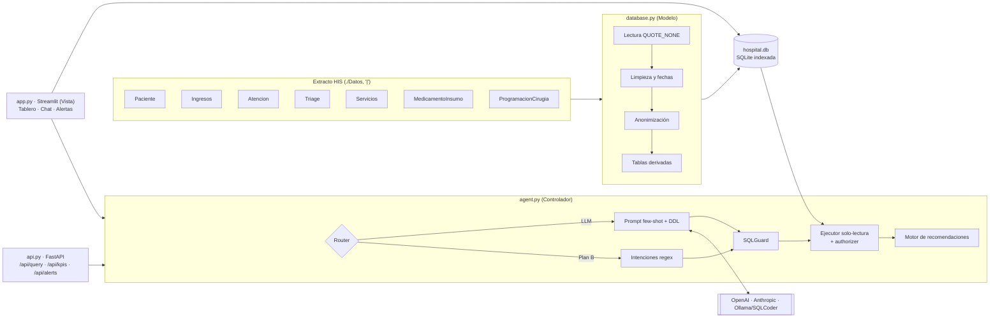
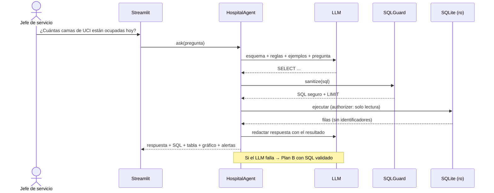

# HSLV · Centro de mando operativo con Agente IA

**Hackatón de Ingeniería de Sistemas · Campus Party FUP 2026**
Reto: Hospital Susana López de Valencia (Popayán, mediana complejidad, ~500 pacientes/día).

## El problema

La información de ocupación de camas, tiempos de espera, quirófanos y farmacia vive en sistemas separados.
Directivos y jefes de servicio dependen de reportes manuales de TI, y las decisiones críticas llegan tarde.

## La solución

Un MVP que unifica el extracto del HIS en una base SQLite y ofrece tres herramientas:

1. **Asistente IA (NL2SQL):** preguntas en español → SQL de solo lectura → respuesta, tabla, gráfico y SQL visible.
   Si el LLM falla o no hay API key, un **Plan B** con SQL validado responde las preguntas clave.
2. **Tablero de KPIs:** ocupación por unidad, espera por triage, causa raíz por turno, diagnósticos,
   rotación de medicamentos, cumplimiento quirúrgico, especialidades y perfil de pacientes.
3. **Alertas y acciones:** sobreocupación con camas a habilitar y personal a reasignar, stock crítico con
   orden de compra, picos de demanda por patología, metas de triage y balance de quirófanos.

---

## Ejecución desde cero

Requisitos: Python 3.10+ y los 7 archivos `.txt` del reto (no se versionan: son datos del hospital).

```bash
git clone https://github.com/62Andrew48/Susana-Lopez-Command-Center.git
cd Susana-Lopez-Command-Center
python -m venv .venv
source .venv/Scripts/activate      # Windows (Git Bash). En Linux/macOS: source .venv/bin/activate
pip install -r requirements.txt
# copiar Paciente.txt, Ingresos.txt, Atencion.txt, Triage.txt, Servicios.txt,
# MedicamentoInsumo.txt y ProgramacionCirugia.txt en ./Datos/
streamlit run app.py               # abre http://localhost:8501; hospital.db se construye sola (~20 s)
```

Si faltan archivos en `Datos/`, la app lo dice en pantalla y no arranca a medias.

Opcional:

```bash
cp .env.example .env              # y configura LLM_PROVIDER + API key para activar el LLM
python database.py --rebuild      # reconstruir la base manualmente
uvicorn api:app --port 8000       # API REST -> http://localhost:8000/docs
python agent.py                   # demo por consola de las 4 preguntas
python -m pytest -q               # 129 pruebas (seguridad, intenciones, LLM simulado, ciclo clínico, RBAC, operación, microservicios)
```

Sin `.env` todo funciona en modo **Plan B** (sin red y sin costo).

---

## Versión 4: pacientes, historia clínica, citas y personal

| Módulo | Admin | Médico | Enfermería | Facturación | Quirófanos | Paciente |
|---|---|---|---|---|---|---|
| Pacientes (registrar, editar, inactivar; correo para el portal) | ✓ | ✓ | | ✓ | | |
| Ficha del paciente (alergias, antecedentes, cama, fórmulas, citas) | lectura | ✓ edita | lectura | | | la suya |
| Registros de historia clínica y adjuntos (crear, corregir con versión, anular) | lectura | ✓ | lectura | | | la suya |
| Buscar historias, descargar PDF, exportar e importar (JSON) | ✓ | ✓ | busca | | | busca en la suya y descarga |
| Alerta de alergia al formular (penicilinas, AINE, sulfas…) | | ✓ | | | | |
| Medicamento sin existencias: en espera, fecha de llegada, se aparta al llegar (30 días) | pedidos | formula | entrega | | | ve la fecha |
| Ocupar / liberar camas con estancia estimada | ✓ | ✓ | ✓ | | ve | |
| Citas (cupos según el turno del médico, sin doble agenda) | | su agenda | | ✓ | | agenda y cancela |
| Turnos de atención (C-007, prioridad Ley 1171 de 2007, pantalla sin nombres) | | llama | | ✓ | | ve cuántos hay antes |
| Usuarios (crear con clave temporal, suspender, restablecer) y turnos del personal | ✓ | | | | | |
| Quirófanos: capacidad probada por área, lista de espera (HIS + solicitudes), programación sugerida | ve | solicita y quita las suyas en espera | | | ✓ | |
| Quirófanos: agendar, cancelar con causa, reprogramar, marcar realizada | | | | | ✓ | |
| Cobertura de personal ahora y sugerencia de reasignación · causa raíz de la espera | ✓ | | | | | |
| Asistente por voz (micrófono del chat) y respuesta leída en voz alta | ✓ | ✓ | ✓ | ✓ | ✓ | ✓ |
| Asistente: adjuntar CSV, Excel, PDF, TXT o imagen y preguntar sobre el archivo | ✓ | ✓ | ✓ | ✓ | ✓ | |
| Eliminar cuentas sin historial (las que tienen historial se inactivan) | ✓ | | | | | |
| Ingresar con Google · recuperar contraseña · modo oscuro | todos | todos | todos | todos | todos | todos |
| Crear su propia cuenta (documento + código al correo registrado en admisiones) | | | | | | ✓ |

Cuentas de prueba (contraseña `demo`): `admin`, `dra.ruiz`, `dr.paredes`, `enf.gomez`, `enf.castro`,
`facturacion.alejandro` (facturación y admisiones: citas y turnos de atención), `quirofanos.bravo` (coordinación de
quirófanos), `paciente.laura`, `paciente.110`. Para probar el autorregistro: "Soy paciente: crear mi cuenta" con
documento `1061800222` y correo `maria.ortiz@correo.demo` (sin SMTP el código aparece en pantalla). Los cinco pacientes con nombre (Laura, Carlos, María,
Juan José y Rosa) son **casos sintéticos** de demostración; los pacientes del extracto llegan anonimizados.

Seguridad añadida: contraseñas nuevas con PBKDF2-SHA256 y sal; política de 8 caracteres con letras y números;
cambio obligatorio de la clave temporal; códigos de recuperación guardados como huella; la historia clínica,
las versiones, los adjuntos y los movimientos de camas no se borran (Res. 1995 de 1999); cada búsqueda, descarga,
exportación e importación queda en la bitácora.

**Reglas de quirófanos** (`surgery_planner.py`): solo coordinación agenda, cancela programadas, reprograma y marca
realizadas; no se agenda en el pasado ni a más de 90 días, ni dos cirugías del mismo paciente el mismo día; una urgente
a más de 24 h o un día sin cupos exige justificación (15+ caracteres) que queda guardada; cancelar exige causa y, si es
para hoy/mañana o la causa es "Otro", detalle. Nada se borra: queda cancelada con quién, cuándo y por qué.

**Ingreso con Google** (opcional): copiar `.streamlit/secrets.toml.example` como `.streamlit/secrets.toml` y poner el
ID y secreto de un cliente OAuth de Google Cloud (el archivo explica los pasos). Solo entra quien tenga ese correo en
su cuenta del hospital; tener cuenta de Google no da acceso. Sin ese archivo el botón no aparece.

**Cuenta del paciente**: admisiones registra el correo en los datos del paciente; el paciente escribe su documento y
ese correo, recibe un código de 6 dígitos (15 min, un uso, 3 por hora) y crea su contraseña. El código llega al correo
registrado, así nadie abre la cuenta de otro con solo saber su documento.

**Archivos en el asistente**: CSV/Excel se resumen con cifras verificables (filas, columnas, vacíos, mínimo, promedio,
máximo); las columnas que identifican pacientes (nombre, documento, contacto, diagnóstico) se ocultan antes de mostrar
o enviar nada a la IA. PDF/TXT: con IA responde la pregunta; sin IA muestra el comienzo. Imágenes: solo con Gemini.
Los archivos no se guardan.

## Versión 3: una pantalla por pregunta

La interfaz se reorganizó para que cada rol vea primero lo que tiene que hacer, no el histórico:

- **Hoy** (inicio): cuatro cifras del día, **"Qué hacer ahora"** con el botón que lo resuelve y la **cola de
  urgencias** a la hora del reloj clínico (códigos `URG-xxxx` no reversibles, sin nombres). El paciente ve sus
  medicamentos por reclamar y su próxima cita.
- **Mapa de camas** por piso, habitación y cama. El piso y la habitación salen del código del HIS
  (`H-203C` = piso 2, habitación 203, cama C). Buscador de un clic: *¿dónde hay cama libre para un adulto, un niño,
  un recién nacido, maternidad o UCI?* Las camas virtuales se muestran como **capacidad de expansión**.
- **Campana de notificaciones** por rol, con enlace a donde se resuelve cada aviso.
- **Inicio de sesión** con usuario y contraseña, tarjeta del usuario (iniciales, rol, turno) y cierre de sesión.
- **Inventario de farmacia** (gerencia): existencias, llegada de pedidos (incluida la orden completa de urgentes),
  conteo físico con ajuste y motivo, y el historial de movimientos. El stock nunca se edita: todo es un movimiento
  del libro mayor, y las alertas de farmacia se recalculan al instante.
- **Asistente flotante** en todas las páginas, con alcance por permisos:

| Rol | Qué puede preguntar |
|---|---|
| Admin y Médico | Toda la base analítica anonimizada (LLM o Plan B), ubicación de camas, glosario; ve el SQL |
| Enfermería | Camas, inventario, rotación, espera en urgencias, alertas y glosario. Sin SQL libre ni LLM |
| Paciente | Solo sus fórmulas y citas, y el glosario. Nunca consulta la base del hospital |

- **Glosario del sector salud** (tomado del glosario entregado con el reto): al pasar el cursor por un término y
  en el chat ("¿qué es triage II?").

## Microservicios predictivos (solo gerencia)

Cuatro servicios Flask independientes en `microservicios/` (urgencias, quirófanos, farmacia y consulta
externa), cada uno con un Random Forest validado con partición temporal contra una línea base ingenua
(detalle en `microservicios/README.md`). La app los consume con `ml_services.py`:

- **Página "Pronósticos"** (Admin): una tarjeta por servicio con la predicción, su rango probable, si mejora o
  no a la línea base y el reporte Excel.
- **Asistente:** una pregunta de pronóstico ("¿cuántos ingresos a urgencias se esperan mañana?") va al
  microservicio del dominio.
- **Fiabilidad:** tiempo máximo de 2 s por llamada y circuit breaker de 30 s. Si un servicio cae, su tarjeta
  dice "no disponible", las demás siguen y el asistente responde con el histórico avisando el motivo.

```bash
for s in microservicios/service_*/; do pip install -r "$s/requirements.txt"; done
python microservicios/run_services.py      # en otra terminal; la app funciona también sin ellos
```

## Versión 2: módulo clínico con roles (RBAC)

La v2 agrega una base transaccional separada (`clinico.db`, esquema en `sql/schema_clinico.sql`) con usuarios,
roles, turnos, historias clínicas, prescripciones, dispensación, citas y un libro mayor de inventario. La interfaz
muestra a cada rol solo sus secciones:

| Sección | Admin | Doctor | Enfermería | Paciente |
|---|:-:|:-:|:-:|:-:|
| Hoy (acciones del turno y cola de urgencias) | ✓ | ✓ | ✓ | ✓ (sus pendientes) |
| Mapa de camas | ✓ | ✓ | ✓ | |
| Indicadores (KPIs, tendencias, camas, urgencias, epidemiología) | ✓ completo | camas y urgencias | camas y urgencias | |
| Asistente IA (página completa con SQL) | ✓ | ✓ | | |
| Asistente flotante | ✓ | ✓ | limitado | solo sus datos |
| Alertas y acciones (semáforo, orden de compra, acciones) | ✓ + CSV | ✓ | ✓ | |
| Pacientes (registrar, editar, inactivar) | ✓ | ✓ | | |
| Buscar historias clínicas | ✓ (solo índice, sin contenido) | ✓ (con contenido) | | |
| Historia clínica: registros y adjuntos (crear, corregir, anular) | | ✓ | lectura | la suya (lectura) |
| Prescripción y entregas (apartado de 30 días) | | ✓ | ✓ (sin prescribir) | |
| Mis fórmulas y citas | | | | ✓ |
| Datos y auditoría (extractos, bitácora) | ✓ | | | |

`clinico.db` se crea y se siembra sola en el primer arranque: 4 usuarios de demostración, turnos diurnos y
6 historias clínicas sobre pacientes e ingresos del extracto (que llegan anonimizados, sin nombre). Las fórmulas y las citas son **sintéticas**.
El reloj de la cabecera (🕒) cambia a turno nocturno o reinicia el escenario sin tocar la base analítica.

### Guion de demostración (≈4 min 30 s)

Antes de cada ensayo: reloj → "Reiniciar escenario clínico" y levantar los microservicios.

1. **Admin → Hoy (20 s):** 86,3 % de camas físicas, "Hospitalización 2 al 100 %" con la cama libre más cercana.
2. **Asistente IA (1 min 15 s):** las 4 preguntas del reto con los botones; una de ellas **por voz** (micrófono
   del chat) y "Escuchar" la respuesta. Abrir "Trazabilidad" para mostrar el SQL. Escribir `borra la tabla de
   ingresos` para mostrar el bloqueo.
3. **Indicadores → Urgencias y espera (20 s):** "¿Por qué cambió la espera?" (causa raíz por turno y triage).
   **Personal y turnos → Cobertura ahora (15 s):** la sugerencia de a quién mover.
4. **Quirófanos (40 s):** cumplimiento 97 %, lista de espera de 41 (40 del HIS sin ejecutar + 1 urgencia),
   gráfico de carga vs. capacidad probada → "Confirmar la programación". La urgencia queda para mañana.
5. **Dra. Ruiz → Clínico y farmacia (40 s):** buscar "Laura" → ficha con **alergia a penicilina** → Prescripción:
   amoxicilina → alerta roja de alergia. Descargar la historia en PDF.
6. **Paciente Laura (30 s):** claritromicina "en espera de existencias, llega el 24 de septiembre".
   **Admin → Inventario → Llegada de pedido:** registrar la claritromicina → queda apartada 30 días para ella.
7. **Facturación · Alejandro (30 s):** Citas del día → Carlos ya tiene turno C-001 → **Dra. Ruiz → Mi agenda →
   Llamar al siguiente**.
8. **Reloj → Turno de noche (20 s):** la historia queda bloqueada → "Romper el vidrio" → aparece en la bitácora.

## Arquitectura



**Secuencia de una pregunta**



| Módulo | Rol MVC | Qué hace |
|---|---|---|
| `config.py` | — | Variables de `.env`, rutas y umbrales de negocio |
| `database.py` | Modelo | ETL, 12 tablas indexadas, funciones de KPI reutilizables |
| `agent.py` | Controlador | NL2SQL, `SQLGuard`, ejecutor seguro, Plan B, `RecommendationEngine`, Factory de LLM |
| `app.py` + `ui/` | Vista | Cabecera, menú por permisos y páginas: `pages_hoy`, `pages_camas`, `pages_analytics`, `pages_clinical` |
| `ui/assistant_scope.py` | Controlador | Qué puede responder el asistente según los permisos del rol |
| `ui/notifications.py` | Servicio | Notificaciones por rol (lógica pura, probada) |
| `ui/glossary.py` | — | Términos del sector salud en lenguaje sencillo |
| `pharmacy_service.py` | Servicio | Ciclo de prescripción, caducidad con retorno a stock y autorización RBAC |
| `demo_seed.py` | — | Escenario de demostración y reloj clínico |
| `api.py` | Servicio | Endpoints REST del reto |
| `ml_services.py` | Servicio | Cliente de los microservicios con tiempo máximo y circuit breaker |
| `auth.py` | Servicio | Inicio y cierre de sesión con bloqueo por intentos y auditoría |
| `tests/` | — | 129 pruebas: seguridad SQL, intenciones, LLM simulado, ciclo clínico, RBAC, camas, cola, notificaciones y alcance del asistente |

## Modelo de datos (`hospital.db`)

| Tabla | Filas | Contenido |
|---|---:|---|
| `pacientes` | 14.502 | Anonimizada: sexo, edad, grupo etario, régimen, asegurador, municipio, zona |
| `ingresos` | 17.781 | Episodio + servicio normalizado, capítulo CIE-10, espera, triage, turno, estancia estimada |
| `atenciones` | 17.375 | Primera atención médica |
| `triage` | 16.106 | Clasificación y signos vitales (sin motivo de consulta) |
| `servicios` | 582.357 | Procedimientos CUPS, área y especialidad |
| `medicamentos_insumos` | 579.465 | Dispensación + tipo de ítem |
| `inventario_farmacia` | 1.327 | Consumo 30 días, rotación, stock, días de inventario |
| `ocupacion_diaria` | 2.736 | Censo diario por unidad sobre camas físicas + camas de expansión en uso |
| `camas` | 712 | Catálogo de camas observadas (capacidad) |
| `cirugias` | 6.156 | Programación consolidada y estado (realizada / sin evidencia) |

## Decisiones tomadas a partir de los datos

Estas decisiones salieron de perfilar el extracto antes de programar; conviene mencionarlas ante el jurado.

- **"Hoy" = 21/09/2026**, la última fecha de ingreso del extracto (configurable con `REFERENCE_DATE`).
  Usar la fecha del sistema devolvería cero en todas las preguntas "de hoy".
- **Triage.txt trae comillas sin cerrar** en `MotivoConsulta`: el lector estándar de pandas descarta cientos de
  filas en silencio. Se lee con `quoting=QUOTE_NONE` y no se pierde ninguna.
- **No hay fecha de egreso.** La estancia se estima desde la hospitalización hasta la última prestación
  (servicio o medicamento) registrada.
- **`CodigoCama` es la última cama del episodio.** Un paciente que pasó por UCI y terminó en hospitalización no
  figura como UCI. Consecuencias: la foto del día es confiable (los pacientes que hoy están en UCI sí aparecen),
  pero la serie histórica subestima UCI e intermedios. Por eso el tablero añade los **días-cama facturados**
  (CUPS de internación) y los picos de demanda se calculan por **capítulo CIE-10**, no por servicio: por servicio,
  UCI aparentaba un falso +187 %.
- **No hay existencias de farmacia.** El consumo diario es real; el stock se simula de forma determinística y
  queda marcado (`stock_simulado = 1`). Si farmacia entrega `Datos/Inventario.txt` (`CodigoServicio|Stock`),
  el cálculo pasa a ser real sin tocar código.
- **Camas físicas y virtuales.** El HIS registra 223 camas "virtuales" fuera de Urgencias: capacidad de
  expansión que se habilita cuando las físicas no alcanzan. Toda la app (tablero, agente, alertas, API, mapa)
  mide la ocupación sobre las **300 camas físicas** (86,3 % el 21/09) y reporta aparte los pacientes en camas
  de expansión (108). Contar las virtuales como capacidad escondía saturación real: Hospitalización 3 aparecía
  al 64,5 % estando al 93 %, y el cuidado básico neonatal al 63 % estando al 100 %.
- **Ubicación física.** El código de cama trae piso y habitación en hospitalización y gineco-obstetricia
  (`H-203C`, `G-108B`); las demás unidades solo traen unidad y número. Los datos no traen pasillo ni ala.
- **Cola de urgencias.** Un paciente está "esperando" a la hora `t` si ingresó por urgencias antes de `t` y su
  primera atención (`FechaAtencion`) es posterior a `t`. El extracto llega hasta el 21/09 a las 14:33.
- **Triage:** 17.781 filas en el extracto, 16.106 con `OidTriage`; las 1.675 restantes no tienen identificador
  (el diccionario de datos indica que acepta nulos), no son filas perdidas.
- **Programación quirúrgica sin fecha.** Según el diccionario, `ProgramacionCirugia` solo trae consecutivo,
  paciente, ingreso y código de servicio. La fecha y el quirófano se derivan de los servicios prestados en
  áreas de QUIRÓFANOS del mismo ingreso.
- **Cirugías:** solo 1.345 de 6.156 programaciones tienen su ingreso dentro del extracto; el cumplimiento se
  calcula sobre ellas (97 %).

## Seguridad

- **SQL:** solo `SELECT`/`WITH`, una sentencia, lista negra (`DROP`, `DELETE`, `UPDATE`, `INSERT`, `PRAGMA`,
  `ATTACH`…), sin tablas `sqlite_*`, comentarios eliminados, `LIMIT` forzado.
- **Defensa en profundidad:** conexión `mode=ro` + `set_authorizer` de SQLite que niega cualquier escritura
  aunque el filtro fuera evadido + tiempo máximo por consulta.
- **Privacidad:** en la ingesta se eliminan nombre, fecha de nacimiento y motivo de consulta; las respuestas
  descartan identificadores (`id_paciente`, `oid_ingreso`…). Un SQL malicioso del LLM se bloquea y se reporta.
- **Credenciales:** solo en `.env` (ignorado por git, igual que los datos del hospital y `hospital.db`).

## API

| Método | Ruta | Descripción |
|---|---|---|
| `POST` | `/api/query` | `{"question": "..."}` → respuesta, SQL, filas, gráfico sugerido, recomendaciones |
| `GET` | `/api/kpis?start=&end=` | KPIs precalculados (por defecto, mes en curso) |
| `GET` | `/api/alerts` | Alertas priorizadas con acción recomendada |
| `GET` | `/health` | Estado, fecha de referencia y motor activo |

---

## Guía para el pitch (7 minutos)

**1. Problema (40 s).** "El hospital atiende ~500 pacientes al día con la información repartida entre HC, farmacia,
admisiones y hojas de cálculo. El jefe de servicio pide un reporte a TI y llega tarde; mientras tanto, hoy
Hospitalización 2 está al 100 %."

**2. Solución (30 s).** Un centro de mando con un asistente de IA que responde en lenguaje natural (escrito o por
voz) sobre el extracto del HIS del reto (más de 1,2 millones de registros, datos sintéticos), con tablero,
alertas y la operación diaria conectada: camas, farmacia, historia clínica, citas, turnos y quirófanos.

**3. Demo (4 min 30 s).** Seguir el guion de arriba. Las 4 preguntas del reto van primero.

**4. Valor añadido (45 s).**
- Causa raíz de la espera y recomendación de reasignar personal (lo piden los puntos 7 y h del reto).
- Quirófanos: programación de la lista de espera según la capacidad que cada área ya demostró operar.
- Pronósticos por servicio con su nivel de confianza e informe gerencial en PDF.
- Seguridad clínica real: alergias, medicamento apartado 30 días, historia que no se borra, bitácora.

**5. Arquitectura y tecnologías (30 s).** Streamlit → FastAPI → agente NL2SQL (Gemini/OpenAI/Claude/modelo local,
con respaldo de consultas verificadas) → SQLite (analítica de solo lectura + base clínica transaccional) y 4
microservicios predictivos.

**6. Limitaciones y mejoras (15 s).** Ver la sección siguiente.

**Frases que aguantan preguntas:** "trabajamos sobre el extracto del reto, no conectados en vivo al HIS"; "los
pacientes con nombre son casos sintéticos, el agente nunca devuelve datos identificables"; "lo que no sabemos
(salas, horas de cirugía, dotación real) no lo inventamos: lo decimos".

**Preguntas probables del jurado**

- *¿Y si el LLM inventa un SQL peligroso?* Tres barreras: filtro, conexión de solo lectura y authorizer del motor.
- *¿Y si no hay internet o se cae la IA?* Responde el respaldo de consultas verificadas (Plan B), sin red.
- *¿Cómo programan quirófanos si no hay salas ni horas?* Capacidad en cirugías/día por área (percentil 90 de lo
  realizado); con salas y horarios, el mismo optimizador asigna por franja.
- *¿El stock es real?* El consumo sí; las existencias iniciales son simuladas y así se marca en pantalla.
- *¿Por qué SQLite?* Es la opción recomendada por el reto; el acceso a datos está aislado para migrar.
- *¿Hay login?* Sí: roles, bloqueo por intentos, PBKDF2 con sal, recuperación con código y bitácora de todo.

## Limitaciones y mejoras futuras

| Limitación | Mejora |
|---|---|
| Dependencia de API externa y envío de preguntas fuera del hospital | **Modelo local** (Ollama + SQLCoder) ya soportado con `LLM_PROVIDER=ollama` |
| Extracto histórico sin egresos ni traslados de cama | Integración en tiempo real con la Historia Clínica Electrónica (HL7 FHIR) |
| Stock simulado | Conector al inventario de farmacia |
| Alertas por reglas y umbrales | **Machine learning** (Prophet / gradient boosting) para pronosticar ingresos y consumo por patología |
| Contraseñas de demostración con sha256 y sesión en memoria de Streamlit | argon2/bcrypt, JWT y proveedor de identidad institucional |

## Tecnologías

Python 3.10+, pandas, SQLite, Streamlit, Plotly, FastAPI, Uvicorn, Pydantic, Requests, python-dotenv, pytest.
LLM opcional: OpenAI, Anthropic u Ollama.

## Equipo

| Integrante | Rol |
|---|---|
| Sebastián Moncayo Ordoñez | Dirección del proyecto, experiencia por rol (Hoy, mapa de camas, notificaciones, asistente) |
| _(nombre)_ | _(rol)_ |
| _(nombre)_ | _(rol)_ |
